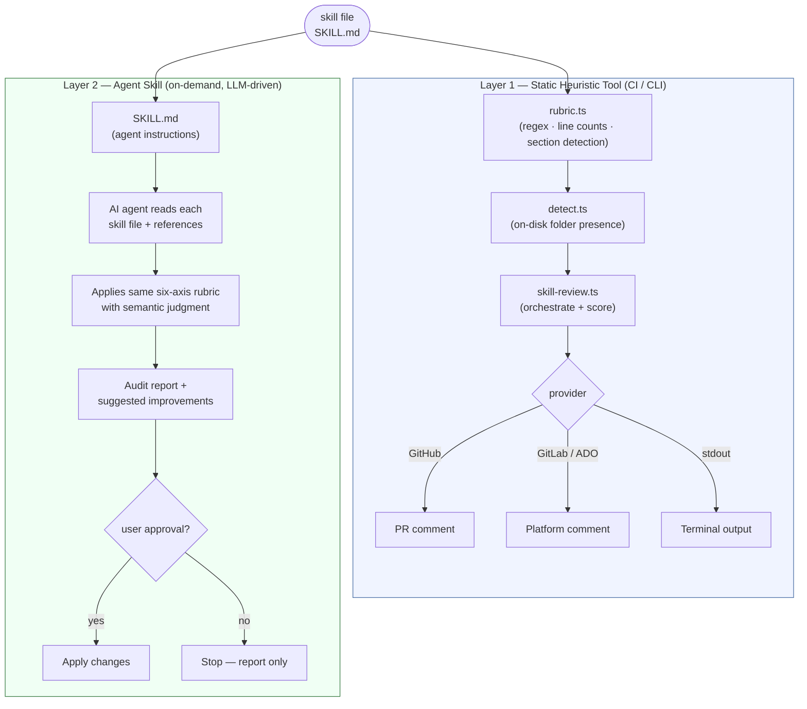

# Architecture

The `skill-review` audit ships as two complementary layers: a static heuristic tool that runs in CI or from a terminal, and an agent skill that runs on demand in an AI agent session. The diagram below shows how they relate.

**Key principle:** Layer 1 is a *floor check* — fast, free, reproducible. Layer 2 is a *ceiling check* — semantic, contextual, human-in-the-loop. Neither replaces the other.

| Layer | Where | Driven by | When it runs |
|-------|-------|-----------|--------------|
| Static heuristic tool (`rubric.ts`) | CI / CLI | Regex + line counts | Every PR, zero cost |
| Agent skill (`SKILL.md`) | Agent session | LLM reasoning | On demand, human-in-the-loop |

## Decisions

The reasons behind the two layers, and behind the choices that keep them working, are recorded as one decision per record in [`docs/adr/`](adr/index.md):

- [ADR-0001: Static Heuristic Scoring Instead Of LLM-Based Scoring](adr/0001-static-heuristic-scoring.md)
- [ADR-0002: Six Scoring Axes Derived From Best Practices](adr/0002-six-scoring-axes.md)
- [ADR-0003: Modular Provider Pattern For Output Targets](adr/0003-modular-provider-pattern.md)
- [ADR-0004: TypeScript With tsx At Runtime And No Compile Step](adr/0004-typescript-tsx-no-compile-step.md)
- [ADR-0005: Portable Standalone Skill Package Alongside The Main Tool](adr/0005-portable-standalone-skill-package.md)
- [ADR-0006: On-Disk Folder Presence Informs Scoring](adr/0006-on-disk-folder-presence-scoring.md)
