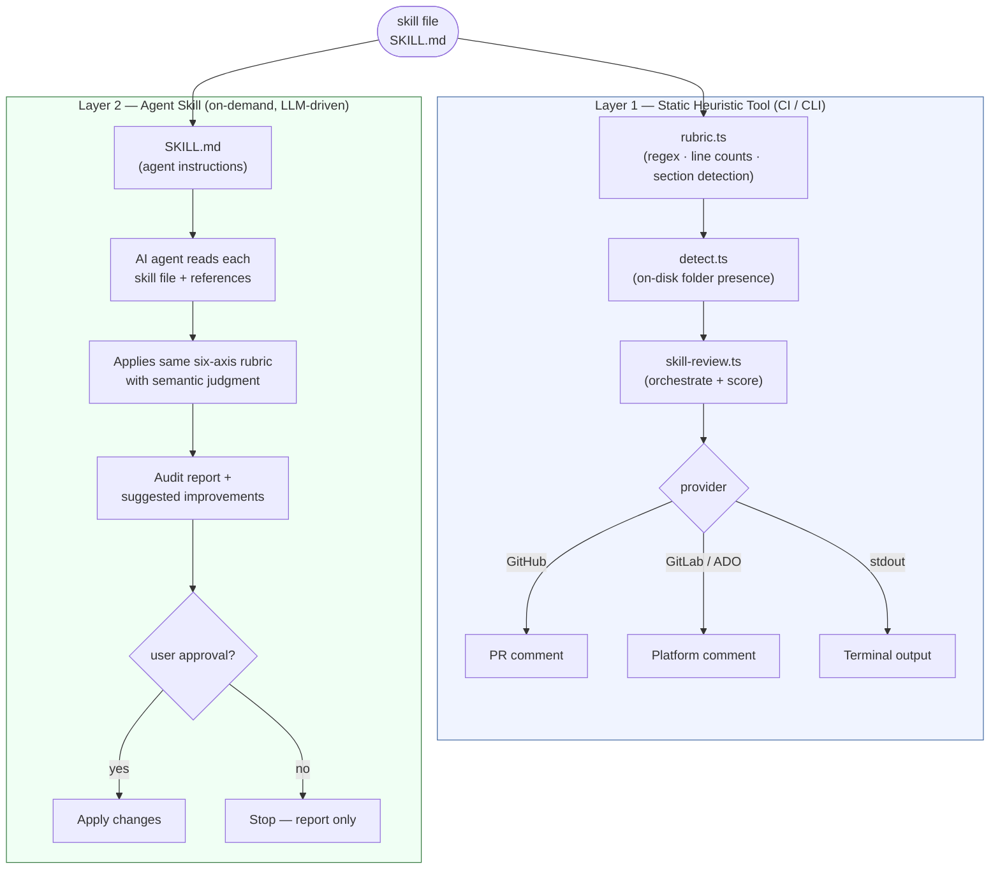

# ADR-0001: skill-review Architecture

**Status:** Accepted  
**Date:** 2026-07-22  
**Deciders:** McFuzzySquirrel  

---

## Context

AI agent skills need a consistent quality bar. Without automated enforcement, skill files drift toward being verbose, generic, or missing critical sections (gotchas, validation steps, load triggers). This ADR captures the architectural decisions made when building the `skill-review` tool.

---

## Decision 1: Static heuristic scoring instead of LLM-based scoring

### Decision

Score skill files using deterministic text heuristics (regex patterns, line counts, section detection) rather than calling an LLM to evaluate quality.

### Rationale

- **Zero cost and zero latency.** CI runs on every PR without API spend.
- **Reproducible.** The same file always produces the same score, making diffs and regressions easy to identify.
- **No secret management in CI.** No `OPENAI_API_KEY` or similar token is needed to run the audit step.
- **Introspectable.** Reviewers can read `rubric.ts` to understand exactly what the tool checks; there is no black box.

### Trade-offs

Static heuristics cannot understand semantics. A skill file could satisfy every regex pattern yet still contain bad advice. The rubric is a floor check, not a comprehensive review. An LLM-assisted review layer can be layered on top without replacing this tool.

**Note:** That agent/LLM layer already exists. `SKILL.md` (the portable agent skill shipped with this package) is exactly that layer — it instructs an AI agent to read each skill file, apply semantic judgment using the same six-axis rubric, and produce a richer, context-aware audit. The two layers are complementary:

| Layer | Where | Driven by | When it runs |
|-------|-------|-----------|--------------|
| Static heuristic tool (`rubric.ts`) | CI / CLI | Regex + line counts | Every PR, zero cost |
| Agent skill (`SKILL.md`) | Agent session | LLM reasoning | On demand, human-in-the-loop |

---

## Decision 2: Six scoring axes derived from agentskills.io best practices

### Decision

Skills are scored on exactly six axes (1–3 each), producing a single composite overall score:

| Axis | What it measures |
|------|-----------------|
| Context economy | Absence of generic, fundamental explanations |
| Gotchas coverage | Presence of concrete, environment-specific edge cases |
| Procedural clarity | Step-by-step process with decision criteria |
| Progressive disclosure | Reference material offloaded to `references/` or `assets/` |
| Calibration | Prescriptiveness matched to task fragility |
| Validation | Self-check steps the agent can run |

### Rationale

The six axes map directly to the failure modes observed in real-world skill files: token waste (context economy), silent failures (gotchas), declarative-only output (procedural clarity), monolithic files (progressive disclosure), uniform prescriptiveness (calibration), and no verification (validation). Limiting to six keeps the rubric reviewable and the feedback actionable.

---

## Decision 3: Modular provider pattern for output targets

### Decision

PR comments and report output are posted through a pluggable `Provider` interface (`scripts/providers/provider.ts`). Concrete providers exist for GitHub, GitLab, Azure DevOps, and stdout.

### Rationale

- Each CI platform has a different API for posting PR comments. Decoupling output from scoring keeps `rubric.ts` pure and testable.
- Adding support for a new platform (e.g., Bitbucket) requires only a new file in `scripts/providers/` — no changes to the audit logic.
- The `stdout` provider makes local runs trivially simple without any CI credentials.

---

## Decision 4: TypeScript with `tsx` at runtime — no compile step

### Decision

Scripts are authored in TypeScript and executed directly with `tsx` (no `tsc` emit step). Type correctness is verified separately with `tsc --noEmit` (`npm run typecheck`).

### Rationale

- **Simplicity.** A single `npm run skill-review` invocation works without a build artefact. This matters for the portable standalone skill package where users copy the folder and run it immediately.
- **Type safety without build friction.** `tsx` compiles on the fly; `tsc --noEmit` enforces types in CI without producing output files that could go stale.
- **Node.js ESM compatibility.** The package uses `"type": "module"` throughout, and `tsx` handles the ESM+TypeScript combination correctly without a custom build pipeline.

---

## Decision 5: Portable standalone skill package alongside the main tool

### Decision

A self-contained copy of the skill + scripts is maintained at `templates/skills/skill-review/`. This is a drop-in package with its own `package.json` that can be copied directly into `.agents/skills/skill-review/` in any project.

### Rationale

Many users want their AI agent to be able to run the audit autonomously from within the repo, not as a separate CI job. Shipping the skill as a self-contained package (SKILL.md + scripts + package.json) allows zero-config adoption: copy one directory, `npm install`, done.

The trade-off is that `scripts/rubric.ts`, `scripts/skill-review.ts`, and `scripts/detect.ts` exist in two places and must be kept in sync. Sync is enforced by copying during development and validated by diffing in CI.

---

## Decision 6: On-disk folder presence informs scoring, not just SKILL.md content

### Decision

When scoring `Progressive disclosure` and `Validation`, the auditor checks whether `references/`, `assets/`, and `scripts/` directories **exist on disk** (passed in from `skill-review.ts` via `AuditInput`) in addition to whether the SKILL.md file mentions them.

### Rationale

A skill author may have already created a `references/` directory with files but not yet linked them all from `SKILL.md`. Without the on-disk check, the tool would incorrectly score such a skill at 1 and suggest "create a references/ directory" — contradicting the existing structure. The fix:

- Boosts the score appropriately when the directory exists (existence counts as partial credit).
- Replaces the "create a directory" suggestion with "link your existing files with load triggers".

---

## Alternatives Considered

| Alternative | Reason rejected |
|-------------|----------------|
| YAML-based rubric config | More flexible but adds a parsing layer and makes the scoring harder to trace |
| Single monolithic script | Was the initial implementation; split into `rubric.ts` / `detect.ts` / `skill-review.ts` to improve testability |
| Gitsubmodule delivery | Harder to adopt than a simple directory copy; creates version-pin friction |
| Score 1–5 instead of 1–3 | More granularity doesn't improve actionability; 1/2/3 maps cleanly to needs-work/adequate/strong |

---

## System Architecture: Two-Layer Review

The tool ships with two complementary review layers. The diagram below shows how they relate.

**Key principle:** Layer 1 is a *floor check* — fast, free, reproducible. Layer 2 is a *ceiling check* — semantic, contextual, human-in-the-loop. Neither replaces the other.
